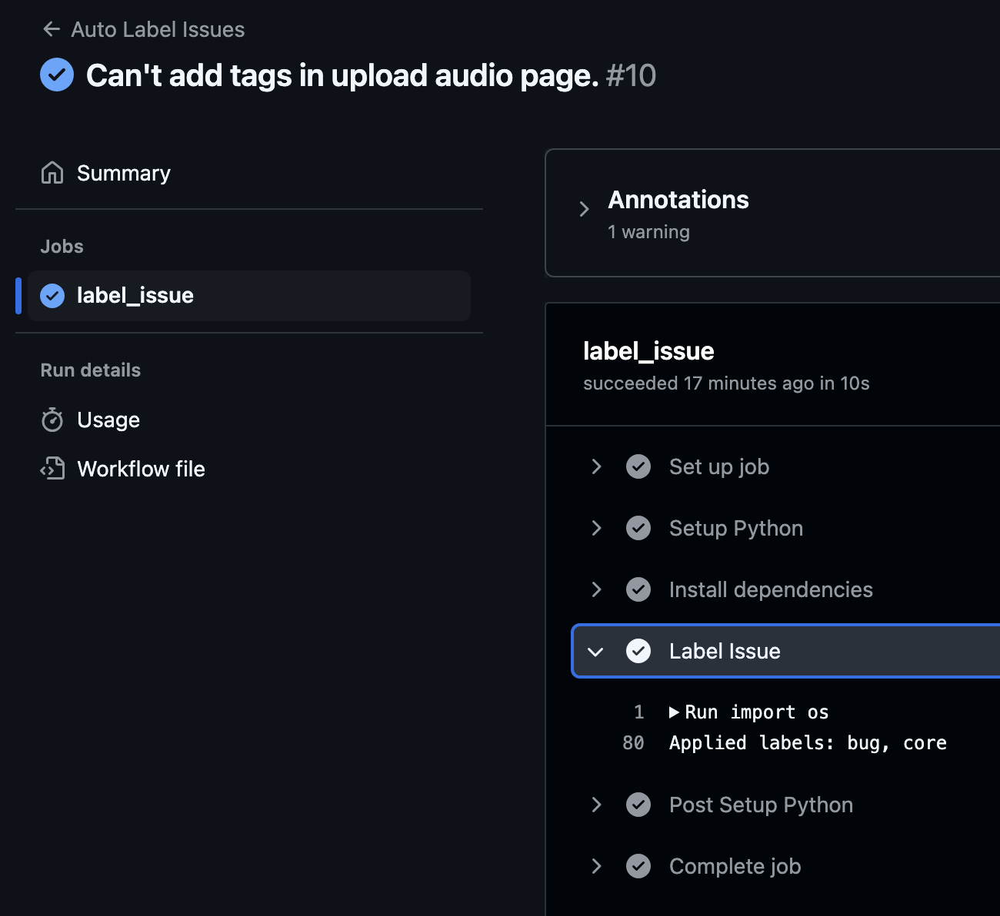

# Github issue autotagger

This is a github action that automatically tags issues with the appropriate labels based on the content of the issue. It uses an LLM (currently gpt-4o-mini) to decide what labels to apply based on the issue text and list of available labels in your project.

I wrote this for myself because I'm lazy and it seemed like a good place for LLMs. 

# Installation

__1. Copy file to your repo:__
* Create .github/workflows folder in your repo at the root level
* Copy in this file

__2. Create a new repository secret for your OpenAI API key (if you don't have one, check the latest OpenAI developer quickstart)__
* In your GitHub repo, click Settings, Secrets and Variables, Actions
* Create new repository secret with the name OPENAI_API_KEY and paste in your key

__3. Check it in:__
* git add .
* git commit -m "Adding LLM-based issue tagger"
* git push origin main

__4. Now add or edit an issue. After a few seconds you'll see new labels (hopefully)__

# Caveats
* LLMs aren't perfect. It may not always get the labels right.
* This will cost you a few cents over time. Nothing to write home about. [OpenAI pricing](https://openai.com/api/pricing/)

# Troubleshooting
Check the Actions logs if it doesn't look like things are working. This should point you in the right direction

# Examples
Successful issue label:

___

What the log looks like:

